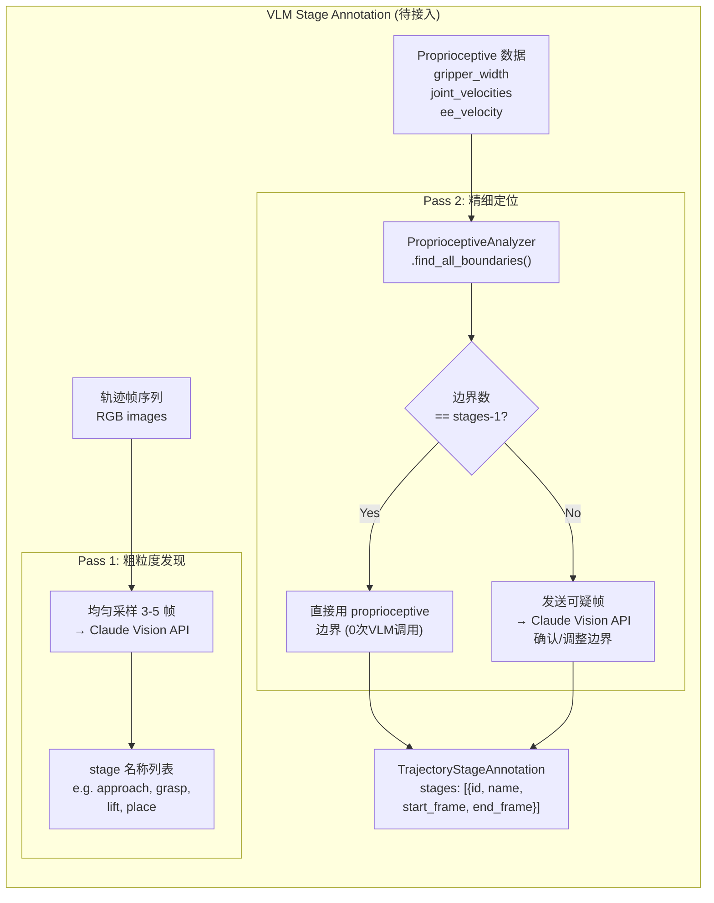
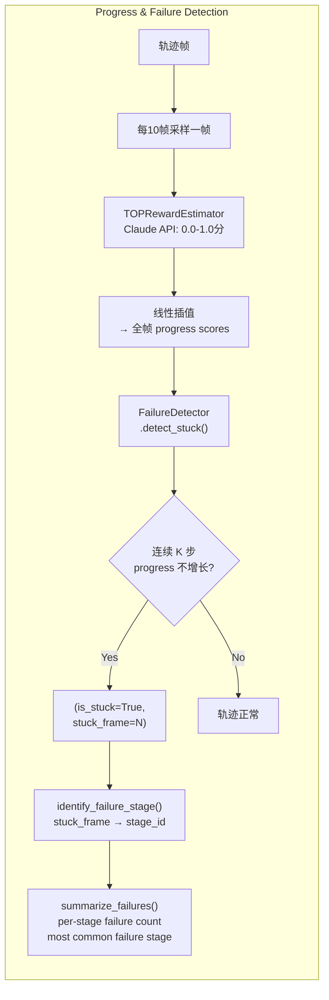
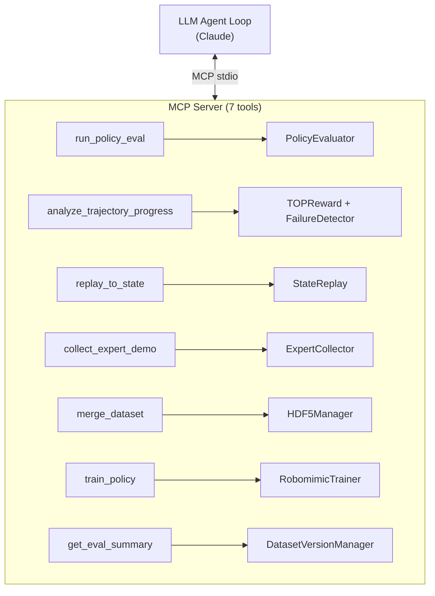
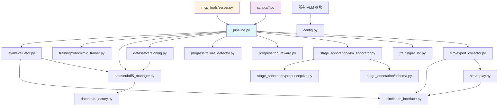

# AutoDAgger Pipeline Flowchart

## 完整数据流

```mermaid
flowchart TD
    START([开始]) --> CONFIG[create_default_config.py<br/>生成 PipelineConfig JSON]
    CONFIG --> INIT[AutoDAggerPipeline.__init__<br/>初始化所有子模块]

    %% ========== Round 0 ==========
    subgraph ROUND0 ["Round 0: 初始训练"]
        INIT --> HAS_DEMOS{有预存的<br/>initial_demos.hdf5?}
        
        HAS_DEMOS -->|Yes| LOAD_DEMOS[直接加载 HDF5]
        HAS_DEMOS -->|No| COLLECT_INIT["ExpertCollector.collect_initial_demos()<br/>① IsaacInterface.reset()<br/>② _run_scripted_expert() → CuRobo+M2T2<br/>③ 录制 TrajectoryData"]
        
        COLLECT_INIT --> SAVE_INIT["HDF5Manager.append_trajectories()<br/>→ initial_demos.hdf5"]
        
        LOAD_DEMOS --> VERSION0
        SAVE_INIT --> VERSION0["DatasetVersionManager<br/>.create_round_dataset(0)<br/>→ round_0.hdf5"]
        
        VERSION0 --> CUMUL0["DatasetVersionManager<br/>.create_cumulative_dataset(0)<br/>合并所有 round → cumulative_0.hdf5"]
        
        CUMUL0 --> TRAIN0["RobomimicTrainer.train()<br/>① generate_config() → JSON<br/>② subprocess → robomimic/scripts/train.py<br/>③ get_best_checkpoint() → π₁.pth"]
    end

    %% ========== Round 0 Eval ==========
    subgraph EVAL0 ["Round 0: 评估"]
        TRAIN0 --> EVAL_R0["PolicyEvaluator.evaluate(π₁)<br/>① _load_policy(checkpoint)<br/>② _create_env() → Isaac Sim<br/>③ _run_episode() × num_episodes<br/>④ 保存 success/failure HDF5"]
        
        EVAL_R0 --> METRICS0["返回 eval_summary:<br/>success_rate, failure_path,<br/>avg_steps, num_episodes"]
    end

    %% ========== DAgger Loop ==========
    METRICS0 --> LOOP_START

    subgraph DAGGER ["DAgger 循环 (Round N)"]
        LOOP_START{success_rate<br/>≥ target?} -->|Yes| DONE([完成 ✓])
        LOOP_START -->|No| CHECK_IMP{improvement<br/>< min_threshold<br/>且 round≥2?}
        CHECK_IMP -->|Yes| DONE
        CHECK_IMP -->|No| ANALYZE

        %% ---- 失败分析 (两层策略 + Stage缓存) ----
        subgraph FAILURE_ANALYSIS ["失败分析"]
            ANALYZE["HDF5Manager<br/>.read_failed_trajectories()"] --> HAS_FRAMES{有渲染帧?}

            HAS_FRAMES -->|Yes| STAGE_CACHE{_task_stage_cache<br/>已有该 task?}
            STAGE_CACHE -->|No| DISCOVER["_discover_task_stages()<br/>VLMStageAnnotator 标注1条轨迹<br/>→ 缓存 stage 定义<br/>→ 持久化 stage_definitions.json"]
            STAGE_CACHE -->|Yes| PROGRESS
            DISCOVER --> PROGRESS

            PROGRESS["TOPReward 打分<br/>→ FailureDetector.detect_stuck()<br/>→ stuck_frame"] --> MAP_STAGE_F["_map_failure_to_stage()<br/>比例缩放缓存 stage 边界<br/>→ 映射 stuck_frame 到 stage<br/>(无 VLM 调用)"]

            HAS_FRAMES -->|No| TIER2["Tier 2: Proprioceptive 回退<br/>① 提取 gripper/vel/ee 信号<br/>② ProprioceptiveAnalyzer<br/>③ 最后边界 or 80%帧位"]

            MAP_STAGE_F --> FAILURES["failures 列表:<br/>{trajectory, failure_frame,<br/>stage_annotation}[]"]
            TIER2 --> FAILURES
        end

        %% ---- Recovery 采集 ----
        subgraph RECOVERY ["Recovery Demo 采集"]
            FAILURES --> CAP["限制数量:<br/>max_recovery_demos_per_round"]
            CAP --> REPLAY["对每个 failure:<br/>StateReplay.replay_to_frame()<br/>→ Isaac Sim 跳到失败帧"]
            REPLAY --> EXPERT["ExpertCollector<br/>._run_scripted_expert()<br/>从失败状态完成任务<br/>录制 recovery trajectory"]
            EXPERT --> RECOVERY_DEMOS["recovery_demos:<br/>TrajectoryData[]<br/>metadata.source=RECOVERY"]
        end

        %% ---- 数据合并 & 重训练 ----
        subgraph RETRAIN ["数据合并 & 重训练"]
            RECOVERY_DEMOS --> VERSION_N["DatasetVersionManager<br/>.create_round_dataset(N)<br/>→ round_N.hdf5"]
            VERSION_N --> CUMUL_N["create_cumulative_dataset(N)<br/>合并 round_0..N<br/>→ cumulative_N.hdf5"]
            CUMUL_N --> RA_BC{use_ra_bc?}
            RA_BC -->|Yes| WEIGHT["RABCWeighter<br/>.apply_weights_to_dataset()<br/>progress加权"]
            RA_BC -->|No| TRAIN_N
            WEIGHT --> TRAIN_N["RobomimicTrainer.train()<br/>→ π_{N+1}.pth"]
        end

        %% ---- 评估 ----
        TRAIN_N --> EVAL_N["PolicyEvaluator<br/>.evaluate(π_{N+1})<br/>→ 新 eval_summary"]
        EVAL_N --> LOOP_START
    end

    DONE --> SUMMARY["_build_final_summary()<br/>best_checkpoint,<br/>per-round metrics,<br/>dataset history"]
    SUMMARY --> END([输出 final_summary.json])
```

## VLM Stage Annotation 子流程 (首次发现时调用一次，后续复用缓存)

```mermaid
flowchart LR
    subgraph STAGE_ANN ["VLM Stage Annotation (待接入)"]
        FRAMES["轨迹帧序列<br/>RGB images"] --> PASS1

        subgraph PASS1_BOX ["Pass 1: 粗粒度发现"]
            PASS1["均匀采样 3-5 帧<br/>→ Claude Vision API"] --> STAGES["stage 名称列表<br/>e.g. approach, grasp,<br/>lift, place"]
        end

        PROPRI["Proprioceptive 数据<br/>gripper_width<br/>joint_velocities<br/>ee_velocity"] --> ANALYZER

        subgraph PASS2_BOX ["Pass 2: 精细定位"]
            ANALYZER["ProprioceptiveAnalyzer<br/>.find_all_boundaries()"] --> MATCH{边界数<br/>== stages-1?}
            MATCH -->|Yes| USE_PROP["直接用 proprioceptive<br/>边界 (0次VLM调用)"]
            MATCH -->|No| VLM_REFINE["发送可疑帧<br/>→ Claude Vision API<br/>确认/调整边界"]
        end

        USE_PROP --> OUTPUT
        VLM_REFINE --> OUTPUT["TrajectoryStageAnnotation<br/>stages: [{id, name,<br/>start_frame, end_frame}]"]
    end
```

## Progress Model + Failure Detection 子流程

```mermaid
flowchart LR
    subgraph PROGRESS ["Progress & Failure Detection"]
        TRAJ_FRAMES["轨迹帧"] --> SAMPLE["每10帧采样一帧"]
        SAMPLE --> VLM_SCORE["TOPRewardEstimator<br/>Claude API: 0.0-1.0分"]
        VLM_SCORE --> INTERP["线性插值<br/>→ 全帧 progress scores"]
        INTERP --> STUCK["FailureDetector<br/>.detect_stuck()"]
        STUCK --> RESULT{"连续 K 步<br/>progress 不增长?"}
        RESULT -->|Yes| FAIL_INFO["(is_stuck=True,<br/>stuck_frame=N)"]
        RESULT -->|No| OK["轨迹正常"]
        
        FAIL_INFO --> MAP_STAGE["identify_failure_stage()<br/>stuck_frame → stage_id"]
        MAP_STAGE --> SUMMARY_F["summarize_failures()<br/>per-stage failure count<br/>most common failure stage"]
    end
```

## MCP Tools 映射

```mermaid
flowchart TB
    subgraph MCP ["MCP Server (7 tools)"]
        T1["run_policy_eval"] --> E["PolicyEvaluator"]
        T2["analyze_trajectory_progress"] --> P["TOPReward + FailureDetector"]
        T3["replay_to_state"] --> R["StateReplay"]
        T4["collect_expert_demo"] --> C["ExpertCollector"]
        T5["merge_dataset"] --> M["HDF5Manager"]
        T6["train_policy"] --> TR["RobomimicTrainer"]
        T7["get_eval_summary"] --> V["DatasetVersionManager"]
    end
    
    AGENT["LLM Agent Loop<br/>(Claude)"] <-->|MCP stdio| MCP
```

## 文件间调用关系

```mermaid
graph TD
    PIPELINE["pipeline.py"] --> EVALUATOR["eval/evaluator.py"]
    PIPELINE --> TRAINER["training/robomimic_trainer.py"]
    PIPELINE --> HDF5["dataset/hdf5_manager.py"]
    PIPELINE --> VERSIONS["dataset/versioning.py"]
    PIPELINE --> FAIL_DET["progress/failure_detector.py"]
    PIPELINE --> TOP["progress/top_reward.py"]
    PIPELINE --> VLM_ANN["stage_annotation/vlm_annotator.py"]
    PIPELINE --> RA_BC["training/ra_bc.py"]
    PIPELINE --> EXPERT_COL["sim/expert_collector.py"]
    
    EVALUATOR --> ISAAC["sim/isaac_interface.py"]
    EVALUATOR --> HDF5
    
    EXPERT_COL --> ISAAC
    EXPERT_COL --> REPLAY["sim/replay.py"]
    REPLAY --> ISAAC
    
    VLM_ANN --> PROPRI["stage_annotation/proprioceptive.py"]
    VLM_ANN --> SCHEMA["stage_annotation/schema.py"]
    
    VERSIONS --> HDF5
    
    HDF5 --> TRAJ["dataset/trajectory.py"]
    
    MCP_SERVER["mcp_tools/server.py"] --> PIPELINE
    
    SCRIPTS["scripts/*.py"] --> PIPELINE
    
    ALL_MODULES["所有 VLM 模块"] -.-> CONFIG["config.py"]

    style PIPELINE fill:#e1f5fe
    style MCP_SERVER fill:#fff3e0
    style SCRIPTS fill:#f3e5f5
```
